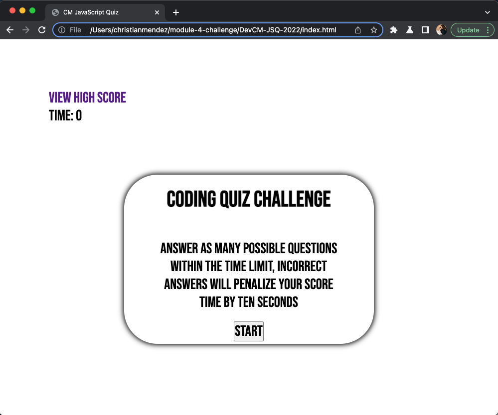
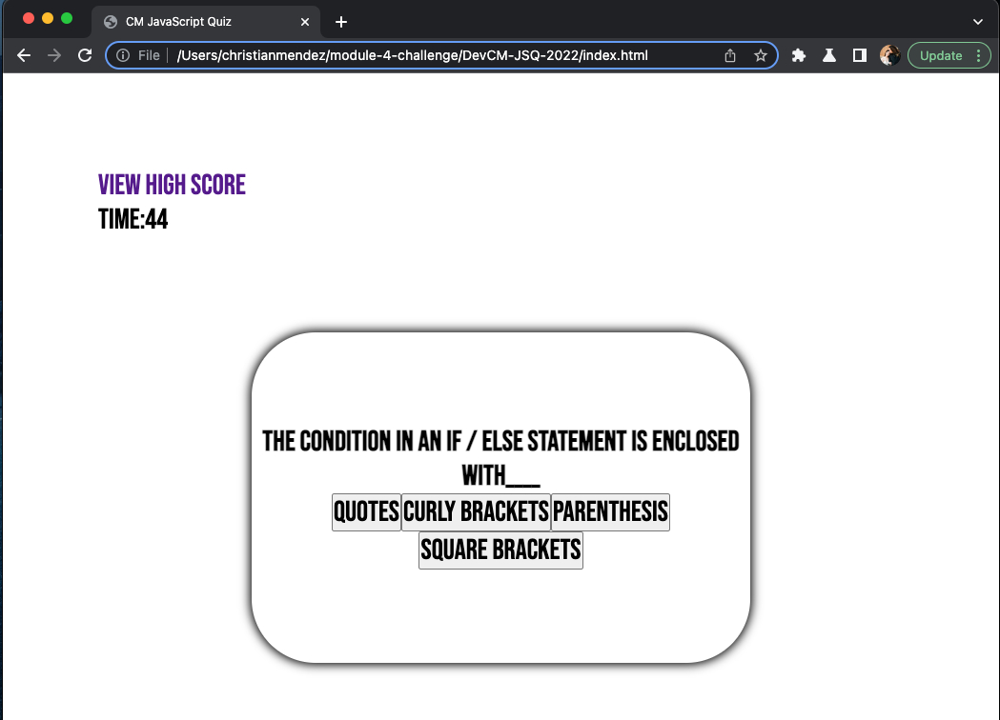
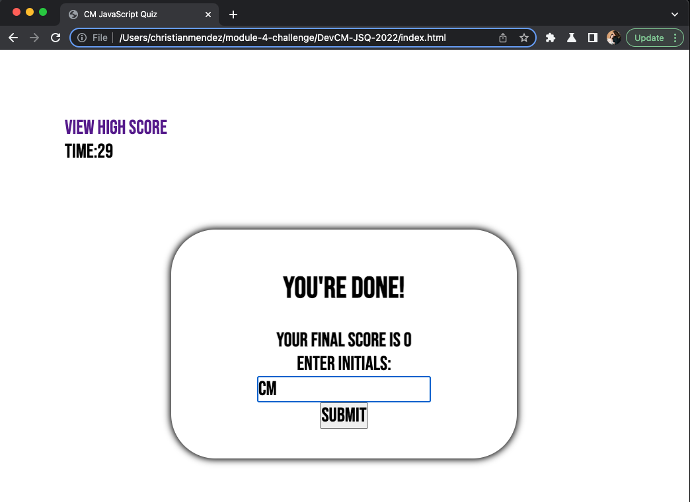
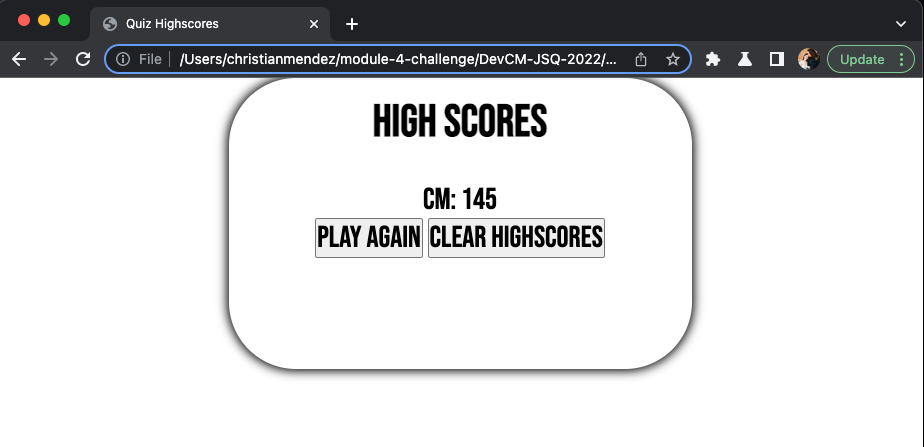

# DevCM-JSQ-2022
Module 4 Challenge 

  ## Table of Contents
  - [Description](#description)
  - [Usage](#usage)
  - [License](#license)
  
  ## Description:
  The purpose of this challenge is to a timed coding quiz with multiple-choice questions. The user will be given five multiple-choice questions and at the end will of the quiz they can submit their highest score. 
  
  Application deployed link:  
    https://christian1512-fe.github.io/DevCM-JSQ-2022/index.html

  ## Usage
  This application is very simple to user. Once the user presses the start button the timer will start counting down, for each question the user gets an incorrect answer the timer will be penelized the user ten seconds out of their timer. Once the user is done with the quiz it they will be able to submit their highest score. Give it a try and see if you can submit the highest score!!! 
  
   
   
   
   

  ## License
The MIT License (MIT)

Copyright (c) 2023 Christian Mendez

Permission is hereby granted, free of charge, to any person obtaining a copy of this software and associated documentation files (the "Software"), to deal in the Software without restriction, including without limitation the rights to use, copy, modify, merge, publish, distribute, sublicense, and/or sell copies of the Software, and to permit persons to whom the Software is furnished to do so, subject to the following conditions:

The above copyright notice and this permission notice shall be included in all copies or substantial portions of the Software.

THE SOFTWARE IS PROVIDED "AS IS", WITHOUT WARRANTY OF ANY KIND, EXPRESS OR IMPLIED, INCLUDING BUT NOT LIMITED TO THE WARRANTIES OF MERCHANTABILITY, FITNESS FOR A PARTICULAR PURPOSE AND NONINFRINGEMENT. IN NO EVENT SHALL THE AUTHORS OR COPYRIGHT HOLDERS BE LIABLE FOR ANY CLAIM, DAMAGES OR OTHER LIABILITY, WHETHER IN AN ACTION OF CONTRACT, TORT OR OTHERWISE, ARISING FROM, OUT OF OR IN CONNECTION WITH THE SOFTWARE OR THE USE OR OTHER DEALINGS IN THE SOFTWARE.